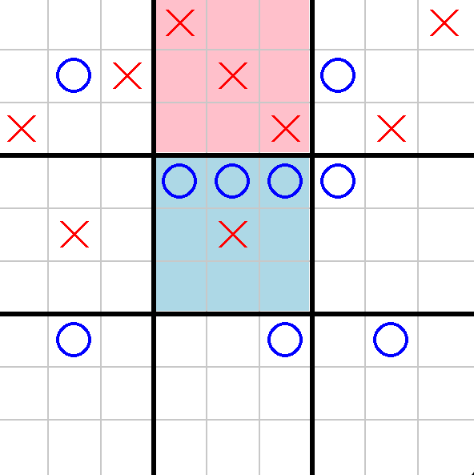

# Ultimate Tic Tac Toe AI Agent

## Overview
This repository contains an AI agent designed to play Ultimate Tic Tac Toe, a more complex variant of the classic Tic Tac Toe game.

## Rules of Ultimate Tic Tac Toe
- The game is played on a 3x3 grid of Tic Tac Toe boards.
- Each move made in a small board dictates which small board the opponent must play in next.
- If a move sends an opponent to a completed or full board, the opponent can choose any other board.
- The goal is to win three small boards in a row to win the game.

## How to Play
The AI agent is equipped to analyze the game state and make optimal moves using the Minimax algorithm. The agent evaluates possible outcomes and strategically decides the best move based on the current game state.



## Installation
Clone this repository and run the provided script to compete against the AI or watch it play against itself.

```bash
python play.py
